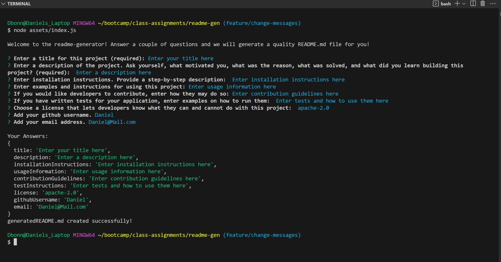

# README-generator

## Description
  
In order to save time when creating a quality repo, I have worked to develop an application using the inquirer package to automate the task k of righting a high quality README.md file. I learned how to install and import packages using the require method, how to access functions from other .js files, and how to use node.js in order to run packages and execute applications from the CLI.

- [Installation](#installation)
- [Usage](#usage)
- [Contribute](#contribute)
- [Tests](#tests)
- [Links](#links)
- [License](#license)
- [Questions](#questions)

## Installation
  
Clone the repository, then at the command line run 'npm i inquirer@8.2.4' to install dependices for this application.

## Usage
  
 At the command line, run node ./assets/index.js and then answer the questions one by one through either user input or using the up-down arrow keys to look through a list.

## Contribute
  
No contributions are necessary, but if you have any thoughts on how I could improve my code please feel free to message me at my email on the bottom of the page.

## Tests
  
No tests have been written for this application.

## Links

https://watch.screencastify.com/v/sySwynxxUxZreNqUaalP

## License
  
This repository is protected under the mit license:   
https://opensource.org/licenses/MIT

## Questions

Username: DanielTBonn  
Github https://github.com/DanielTBonn/,
Email: DanielTBonn@gmail.com